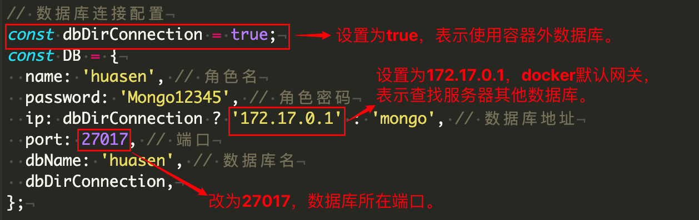

## 📦 部署指南

确保已安装docker、docker-compose环境，并且确保 8787、37017、7379、3000 端口不被占用，否则无法启动容器。

### 运行容器

> ⚠️ 注意命令执行路径

进入 `swan-compose` 目录终端，执行 `docker-compose up -d` 启动命令，等待拉取镜像（首次慢），运行容器。常用命令如下：

1. docker-compose restart，重启所有服务；
2. docker-compose stop，停止所有服务；
3. docker-compose up -d，启动所有服务；
4. docker-compose up -d --build，重新构建镜像并启动，一般在开发完成时，用于更新容器；
5. docker-compose down，删除所有容器，数据不受影响；

### 使用宝塔创建的 MongoDB 数据库

#### 一、创建数据库

#### 二、设置数据库


#### 三、修改连接配置

为此，特意实现后端服务器热更新，即修改配置，后端服务自动更新并重启。打开 `huasen-server/config.js` 文件，按照如下提示修改



## 🐛 开发指南

确保已安装 node.js、docker、docker-compose 环境，否则导致服务启动失败。

### 目录结构

```javascript
├── huasen-mongo 				// 容器内 mongodb 配置及数据
├── huasen-nginx 				// 容器内 nginx 配置及数据
├── huasen-redis 				// 容器内 redis 配置及数据
└── huasen-server				// 后端服务源码
  ├── app.js     				// 服务入口文件
  └── config.js   			// 配置文件
├── huasen-store       	// 静态文件仓库
├── docker-compose.yml 	// docker-compose 编排配置文件
└── huasen-frontend    	// 前端源码
  ├── admin  						// 后台管理界面
  ├── portal 						// 官网界面
```

### 前端开发

> ⚠️ 注意命令执行路径

分别进入 huasen-frontend/portal 、huasen-frontend/admin 目录，执行以下命令，即可启动**官网**、**后台管理**开发服务。

（1）安装依赖

```
npm install
```

（2）运行程序

```
npm run serve
```

（3）打包构建

```
npm run build
```

### 后台服务开发

> ⚠️ 注意命令执行路径

进入 `huasen-server` 目录，执行以下命令，启动**后台服务**。

（1）安装依赖

```
npm install
```

（2）运行程序

进入项目根目录执行 docker-compose up -d redis mongo 提前开启本地 redis、mongo 服务，因为后端服务启动需要连接它们。

```
npm run dev
```

